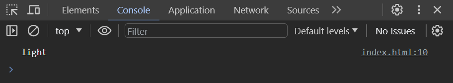
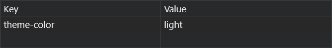

## Getting Started

### Installation

You can install `@jsblocks/theme` library from NPM:

```bash
npm install @jsblocks/theme
```

```JS
import Theme from "@jsblocks/theme"
const theme = new Theme("light", true);
theme.init();
```

<h3 align="center">OR</h3>

You can use it from CDN:

```html
<script src="https://unpkg.com/@jsblocks/theme@1/dist/theme.min.js"></script>
```

### How to use it?

After you include it in your project, write in your JavaScript file:

```JS
const theme = new Theme(/* initialTheme */ "light", /* prefersSystem */ true);
```

then write `theme.init()` to initialize theme:

```JS
theme.init();
```

After that let's check it:

```JS
console.log(theme.currentTheme);
```

Have a look at the result:



LocalStorage:



### Add some HTML buttons

```html
<button type="button" class="light-theme">Light</button>
<button type="button" class="dark-theme">Dark</button>
<button type="button" class="system-theme">System</button>
<!-- Here will show the theme state -->
<div class="current-theme">
    <p>current theme:</p>
    <p class="theme-state"></p>
</div>
```

Now let's select these buttons and the output of current theme:

```JS
const lightThemeBtn = document.querySelector(".light-theme");
const darkThemeBtn = document.querySelector(".dark-theme");
const systemThemeBtn = document.querySelector(".system-theme");
const themeState = document.querySelector(".theme-state");
```

After that let switch theme to light by using `toggleTo(newTheme)` method:

```JS
lightThemeBtn.addEventListener("click", () => {
    theme.toggleTo("light");
});

darkThemeBtn.addEventListener("click", () => {
    theme.toggleTo("dark");
});

systemThemeBtn.addEventListener("click", () => {
    theme.toggleTo("system");
});
```

Now let's the current theme when toggle theme, by using `onToggle(callback)` method:

```JS
theme.onToggle(() => {
    themeState.textContent = theme.currentTheme;
});
```

but we have an issue when reloading the page the `themeState` will be empty, to fix it we will use `onLoad(callback)` method:

```JS
theme.onLoad(() => {
    themeState.textContent = theme.currentTheme;
});
```

Add some styles in your CSS file:

```CSS
[data-theme="light"] body {
    background-color: #fff;
}

[data-theme="dark"] body {
    background-color: #252525;
}

[data-theme="light"] p {
    color: #252525;
}

[data-theme="dark"] p {
    color: #fff;
}
```

Now try to click on the dark theme button

[](../README.md "Back") &nbsp;&nbsp;&nbsp;&nbsp;
[](./api.md "API")

Was useful support me by buying me a coffee:

[](https://ko-fi.com/J3J1NMYT7)
